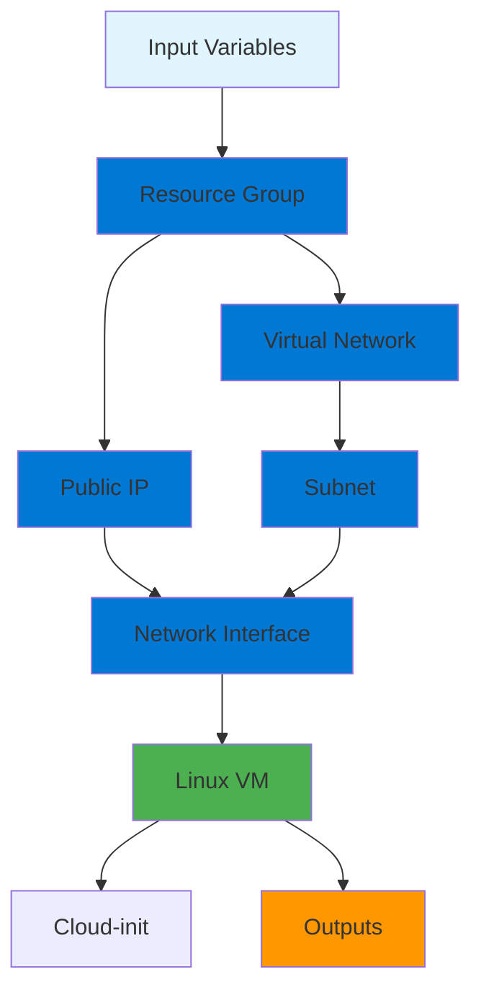
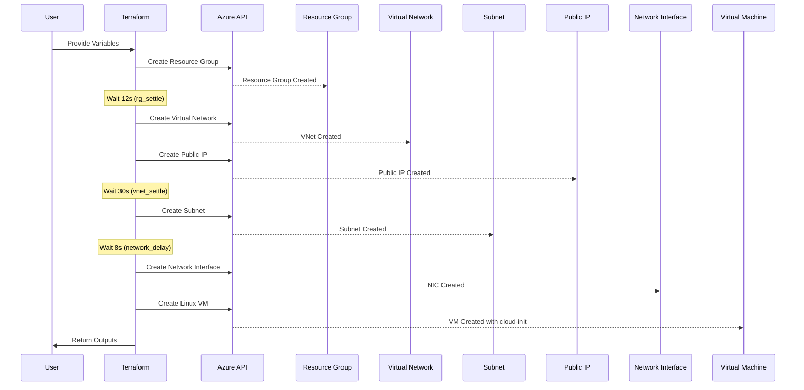
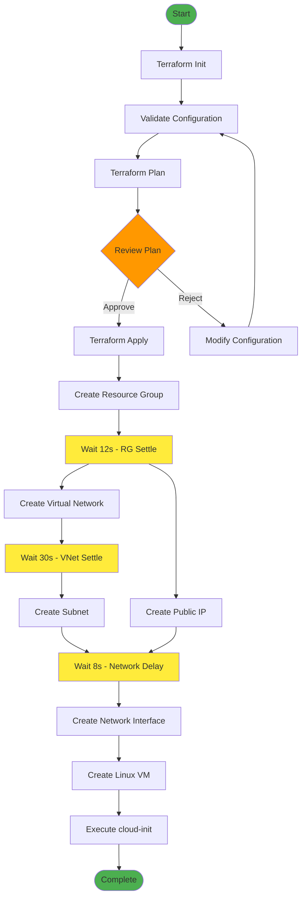
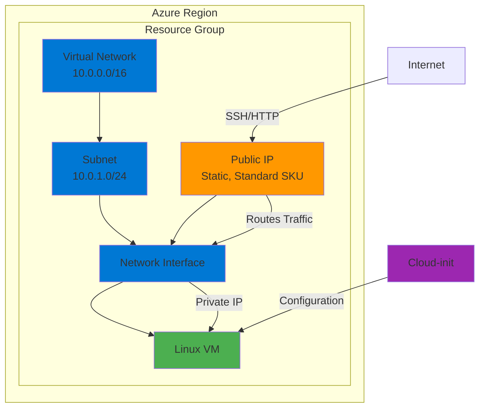
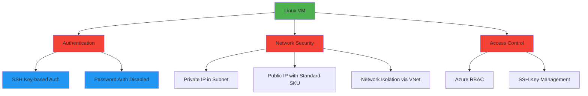

# Azure Hello World Infrastructure Architecture

## Overview

Architecture, components, and deployment flow of the Azure Hello World Terraform infrastructure. This module deploys a Linux Virtual Machine (VM) with networking components in Azure, configured with cloud-init for automated setup.

## Module Structure

```
azure-hello-world/
├── terraform/
│   ├── main.tf              # Main infrastructure resources
│   ├── variables.tf         # Input variables
│   ├── outputs.tf           # Output values
│   ├── providers.tf         # Provider and backend configuration
│   ├── cloud-init.yaml      # Cloud-init configuration
│   └── modules/
│       └── vm_wrapper/      # VM and NIC module
│           ├── main.tf
│           ├── variables.tf
│           └── outputs.tf
├── test/                    # Terratest integration tests
└── docs/                    # Documentation
```

## Component Architecture



## Resource Flow



## Deployment Flow



## Network Architecture



## Infrastructure Components

### Resource Group
- Container for all Azure resources
- Provides logical grouping and resource management
- Includes location and tags

### Virtual Network (VNet)
- Address space: `10.0.0.0/16`
- Provides isolated network environment
- Foundation for subnet and VM networking

### Subnet
- Address prefix: `10.0.1.0/24`
- Contains the VM and network interface
- Extended timeouts for Azure control plane delays

### Public IP Address
- Allocation: Static
- SKU: Standard
- Provides internet-facing IP for VM access
- Extended timeouts for provisioning

### Network Interface (NIC)
- Connects VM to subnet and public IP
- Dynamic private IP allocation
- Single IP configuration with public IP attachment

### Linux Virtual Machine
- **Image**: Ubuntu 22.04 LTS (Jammy)
- **OS Disk**: Standard_LRS, ReadWrite caching
- **Authentication**: SSH key-based (password disabled)
- **Cloud-init**: Automated configuration via custom_data
- Extended timeouts for creation/updates

## Security Architecture



### Security Features
- **SSH Key Authentication**: Password authentication disabled
- **Network Isolation**: VM in private subnet with controlled public access
- **Standard SKU Public IP**: DDoS protection and availability zones
- **Azure RBAC**: Role-based access control for resource management
- **Tags**: Resource tagging for governance and compliance

## Cloud-init Configuration

The VM uses cloud-init for automated configuration:

- **Purpose**: Automated software installation and configuration
- **Format**: Base64-encoded YAML file
- **Execution**: Runs on first boot
- **Location**: `terraform/cloud-init.yaml`

Cloud-init enables:
- Package installation
- Service configuration
- File creation
- User management
- Custom scripts execution

## Timing and Dependencies

### Time Sleep Resources
The infrastructure uses time sleep resources to handle Azure control plane propagation delays:

1. **rg_settle** (12s): After Resource Group creation
   - Ensures RG is fully available before creating dependent resources

2. **vnet_settle** (30s): After Virtual Network creation
   - Prevents 404 errors when creating Subnet

3. **network_delay** (8s): Before Network Interface creation
   - Allows VNet/Subnet/PIP to fully propagate

### Resource Dependencies
```
Resource Group
  ├── Virtual Network (depends on: rg_settle)
  ├── Public IP (depends on: rg_settle)
  └── Subnet (depends on: VNet + vnet_settle)
        └── Network Interface (depends on: Subnet + PIP + network_delay)
              └── Virtual Machine (depends on: NIC)
```

## Module Components

### Root Module (`terraform/`)
- **main.tf**: Resource Group, VNet, Subnet, Public IP, VM module call
- **variables.tf**: Input variables (subscription_id, location, prefix, vm_size, etc.)
- **outputs.tf**: Public IP, web URL, VM name, private IP
- **providers.tf**: Azure provider configuration and backend
- **cloud-init.yaml**: VM initialization script

### VM Wrapper Module (`terraform/modules/vm_wrapper/`)
- **main.tf**: Network Interface and Linux VM resources
- **variables.tf**: Module input variables
- **outputs.tf**: VM name and private IP

## Outputs

The infrastructure provides the following outputs:

- **public_ip**: Public IP address of the VM
- **web_url**: HTTP URL to access the deployed application
- **vm_name**: Name of the created VM
- **private_ip**: Private IP address of the VM NIC

## Best Practices

1. **Use SSH Keys**: Always use SSH key-based authentication, disable passwords
2. **Resource Naming**: Use consistent prefix-based naming convention
3. **Tags**: Apply tags for resource organization and cost tracking
4. **Timeouts**: Extended timeouts handle Azure control plane delays
5. **State Management**: Use Azure Blob Storage backend for state
6. **Cloud-init**: Leverage cloud-init for automated VM configuration
7. **Network Security**: Use Network Security Groups (NSGs) for additional protection
8. **Monitoring**: Enable Azure Monitor and diagnostics for VM monitoring

## Integration Points

- **Azure Resource Manager**: Core Azure API for resource provisioning
- **Azure Blob Storage**: Terraform state backend
- **Azure Monitor**: VM metrics and diagnostics
- **Azure Key Vault**: SSH key storage (recommended for production)
- **Azure RBAC**: Access control and permissions
- **Cloud-init**: VM initialization and configuration

## CI/CD Integration

The infrastructure integrates with GitHub Actions workflows:

- **Provider Detection**: Automatically detects Azure provider
- **Security Scans**: TFSec, Trivy, Checkov for security validation
- **Linting**: TFLint for code quality
- **Testing**: Terratest for integration testing
- **OIDC Authentication**: Azure login via GitHub Actions OIDC
- **Automated Deployment**: Plan and apply via workflow

## Scaling Considerations

- **Horizontal Scaling**: Deploy multiple VMs using count or for_each
- **Load Balancer**: Add Azure Load Balancer for multiple VMs
- **Availability Sets**: Use Availability Sets for VM redundancy
- **Availability Zones**: Deploy across zones for high availability
- **Auto-scaling**: Implement VM Scale Sets for dynamic scaling

## Cost Optimization

- **VM Size**: Choose appropriate VM size (default: Standard_DC1s_v3)
- **OS Disk**: Standard_LRS for cost-effective storage
- **Public IP**: Static IP incurs minimal cost
- **Resource Cleanup**: Ensure proper resource deletion after testing
- **Tags**: Use tags for cost allocation and tracking
